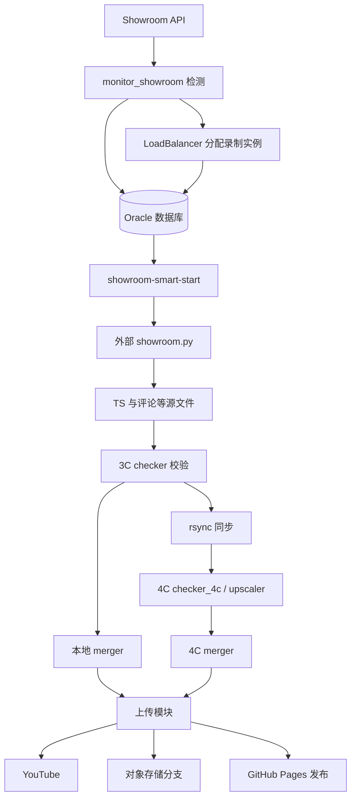

# 01 系统基本设计书

## 目的与范围

现有系统将 Showroom 直播检测、录制进程管理、分片校验、视频加工和发布串联。本文按当前代码描述能力，不将 README 中的运行规模、无故障承诺或吞吐描述视为本次实测结果。

业务对象包括成员、直播场次、录制实例、媒体片段、合并产物及发布结果。成员可以经历多次直播；一次直播可能分裂为多个目录，也可能在两台机器上产生不同阶段文件。

## 架构与责任

图中上传及发布是配置控制的分支，不表示每个视频一定同时发送到全部目标。monitor 的实际部署主机需要核实。

| 模块 | 代码入口 | 责任 |
|---|---|---|
| 检测 | `monitor/monitor_showroom.py` | 异步请求直播状态、内存队列、数据库写入 |
| 分配 | `monitor/load_balancer_module.py` | 查询 active 录制实例并分配成员 |
| 录制管理 | `recorder/showroom-smart-start.py` | 扫描进程、启动/停止与恢复录制 |
| 特定服务恢复 | `recorder/restart_handler.py` | 检查录制活动并调用 systemctl 重启 |
| 3C 校验 | `recorder/checker.py` | 校验分片、内容指纹去重、输出清单、同步 |
| 4C 加工 | `recorder/checker_4c.py`、`upscaler.py` | 接收源片段并生成加工片段 |
| 合并 | `recorder/merger.py` | 读取清单并合并产物 |
| 上传发布 | `recorder/upload_youtube.py` 等 | 认证、上传、播放列表、发布资料 |
| 共享配置 | `shared/config.py`、`db_members_loader.py` | 参数、数据库连接和成员加载 |

## 双环境关系

- **代码确认**：3C/4C 命名出现在同步及校验模块；4C 有专用入口，公共合并/上传模块被两条链引用。
- **用户确认**：两边完整同步项目，而非只复制某几个业务脚本。
- **待核实**：两台机器实际 Python/依赖版本、启动入口、配置差异、资源限制，以及 monitor 所在机器。
- `3C/4C` 是现有环境称呼；不据此推定准确 CPU 核数、内存或机器数量以外的部署拓扑。

## 外部依赖边界

Oracle、Showroom API、YouTube API、对象存储、Git 仓库、SSH/rsync、FFmpeg/FFprobe 均在系统边界之外。真正抓流的 `showroom.py` 由配置路径指定，未在当前仓库文件清单中找到；添加成员是否还依赖其自己的配置必须核实。

## 独立管理脚本

`manage_members.py`、`monitor/manage_instances.py`、`update_playlists_from_yaml.py` 是单独执行的命令行工具。当前代码没有将其作为常驻业务主程序启动；服务器是否有额外定时调度待核实。它们的写操作仍会影响共享业务数据。

源码依据：[检测](../../monitor/monitor_showroom.py)、[录制管理](../../recorder/showroom-smart-start.py)、[同步](../../shared/sync_module.py)、[4C 校验](../../recorder/checker_4c.py)。
