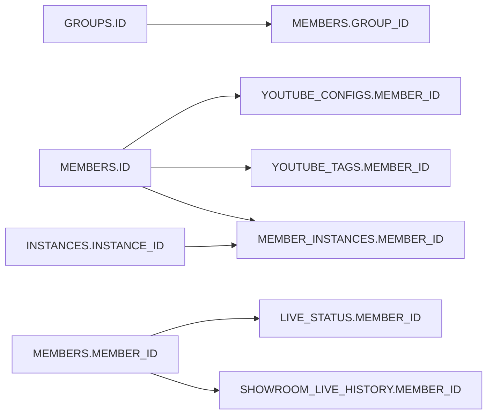

# 03 数据库逻辑设计书

## 证据与限制

本章保留基于源码 SQL 的逻辑模型。现已收到部分用户提供的 DDL；已确认的类型、约束、默认值、外键及触发器详见 [08 DDL 核对记录](08-ddl-review.md)，以该补充为准。未连接生产数据库；实例和分配表已补齐；两个视图也已补齐；序列定义及历史 ID 生成机制仍待确认。以下关联图仍是逻辑图，不应将未获得 DDL 的关系视为已确认外键。

数据库驱动为 cx_Oracle。配置中的直播表名为 `LIVE_STATUS`，历史表名为 `SHOWROOM_LIVE_HISTORY`；SQL 未给这两者统一加 ADMIN 前缀，提供的 DDL 已确认 owner 为 ADMIN，但其中同义词语句被注释，实际未限定名称解析仍待核实。其他表在代码中显式使用 ADMIN。

## 逻辑数据字典

| 对象 | 代码使用的字段 | 作用及主要读写方 |
|---|---|---|
| ADMIN.MEMBERS | ID, MEMBER_ID, GROUP_ID, ROOM_ID, ROOM_URL_KEY, NAME_EN, NAME_JP, TEAM, ENABLED | 成员主数据；loader 读取，成员管理修改启停 |
| ADMIN.GROUPS | ID, NAME | 组合；关联成员 |
| ADMIN.YOUTUBE_CONFIGS | MEMBER_ID, TITLE_TEMPLATE, DESCRIPTION_TEMPLATE, CATEGORY_ID, PRIVACY_STATUS, PLAYLIST_ID, USE_PRIMARY_ACCOUNT | 上传配置；loader 读取，YAML 工具更新播放列表 |
| ADMIN.YOUTUBE_TAGS | MEMBER_ID, TAG, SORT_ORDER | 上传标签；loader 读取 |
| LIVE_STATUS | MEMBER_ID, ROOM_ID, IS_LIVE, STARTED_AT, CHECK_TIME, GROUP_NAME, TEAM_NAME | 最新检测状态；monitor 写入，录制管理读取 |
| SHOWROOM_LIVE_HISTORY | ID, MEMBER_ID, ROOM_ID, STARTED_AT, ENDED_AT, DURATION_MINUTES, UPDATED_AT | 直播历史；monitor 插入/结束更新 |
| ADMIN.INSTANCES | INSTANCE_ID, INSTANCE_TYPE, DISPLAY_NAME, MAX_CAPACITY, HOST_INFO, STATUS, LAST_HEARTBEAT 等 | 检测/录制实例；CLI 维护，分配器读取 |
| ADMIN.MEMBER_INSTANCES | ID, MEMBER_ID, INSTANCE_ID, INSTANCE_TYPE, ENABLED, ASSIGNED_BY, ASSIGNED_AT 等 | 成员与实例分配；分配器写入、录制管理读取 |
| ADMIN.MEMBER_INSTANCES_HISTORY | MEMBER_ID, INSTANCE_ID, INSTANCE_TYPE, ACTION, OLD_INSTANCE_ID, REASON, OPERATED_BY, OPERATED_AT | 分配历史；CLI 查询，生成机制待核实 |
| ADMIN.V_INSTANCE_LOAD | INSTANCE_ID、INSTANCE_TYPE、DISPLAY_NAME、MAX_CAPACITY、STATUS、CONFIG_VERSION、CURRENT_LOAD、AVAILABLE_CAPACITY、LOAD_PERCENT、LAST_HEARTBEAT、UPDATED_AT | 普通视图，按启用分配行实时聚合；DDL 已确认 |

“等”表示这里只列已观察到的主要字段，不是完整建表清单。

## 关键标识区别

- `MEMBERS.ID`：内部数据库标识；实例分配、上传配置、标签使用它关联。
- `MEMBERS.MEMBER_ID`：业务字符串标识；直播状态与直播历史 SQL 使用它。
- `ROOM_ID`：直播平台房间标识；不是成员表内部 ID。
- `INSTANCE_ID`：部署实例业务标识；不是 3C/4C 显示名称的必然映射。

后台接口应明确返回 `id`、`member_id`、`room_id`，不能把它们混成一个字段。成员 business ID 的更名暂不开放，避免割裂历史与进程识别。

这是关联图，不包含尚未证实的基数或唯一性约束。

## 新后台读写责任（规划）

| 数据域 | 第一阶段 | 后续阶段 |
|---|---|---|
| 成员、组合、上传配置 | 只读 | 指定字段的受限写入 |
| 直播状态和直播历史 | 只读 | 仍由原系统维护 |
| 实例与分配 | 只读 | 当前不计划调度或手动修改 |
| 后台登录、审计、归档信息 | 独立存储 | 新后台自行管理 |

添加成员要在核实 DDL 后，在一个业务事务中写入必要的成员及关联配置。成员 ID 已在提供的 DDL 中确认通过触发器引用 MEMBERS_SEQ 生成，但该序列定义尚缺；不得用 MAX(ID)+1 替代。成员停用不等同于立即终止录制；不提供 DELETE 成员物理删除接口作为初版功能。

后台归档是新后台概念，当前 MEMBERS 中未确认有归档字段。若采用独立归档表，需要通过业务标识关联，并明确原系统仅认识 ENABLED。审计与业务库跨库写入无法天然原子化；必须记录请求 ID，并对“业务已提交、审计失败”做对账，不能静默宣告全部失败后重复新增。

## 元数据核对方法

由有权限的运维人员只读导出以下对象的结构，不需要提供成员数据或凭据：

- `ALL_TAB_COLUMNS`：owner、表名、列名、类型、长度、可空性、默认值。
- `ALL_CONSTRAINTS` / `ALL_CONS_COLUMNS`：主键、唯一键、外键和删除规则。
- `ALL_INDEXES` / `ALL_IND_COLUMNS`：索引。
- `ALL_TRIGGERS`、`ALL_SEQUENCES`、身份列相关元数据：ID 及历史生成机制。
- `ALL_VIEWS`、`ALL_SYNONYMS`：负载视图和未限定表名的解析。

以上是需核对的 Oracle 元数据对象清单，不是已运行结果；具体字段可见性依赖数据库版本与权限。导出后再编制可执行迁移，不从本文猜测生成生产 DDL。

源码依据：[成员读取](../../shared/db_members_loader.py)、[分配](../../monitor/load_balancer_module.py)、[实例管理](../../monitor/manage_instances.py)、[成员管理](../../manage_members.py)、[播放列表更新](../../update_playlists_from_yaml.py)。
