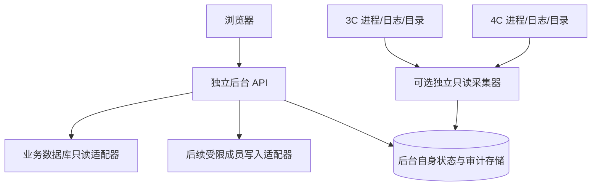

# 06 独立管理后台基本设计书（规划）

## 目标与范围

新项目采用 Python 后端及浏览器页面，具体框架/前端库另行选择，本文不锁定版本。仓库和部署独立于录制上传项目。

范围：成员列表、搜索、详情、新增、编辑、启停/归档；直播状态、实际录制观察、3C/4C 加工状态。明确排除手动开始/停止录制、自动重启服务、修改实例分配、重试上传、删除媒体和数据库物理删除。

## 分阶段结构

第一阶段没有 A，也不依赖 C 即可展示数据库已具备的成员及直播信息。实际录制状态未接入时显示“未接入”，不能默认绿色。

采集器可采用远端只读查询或两端独立服务，实施前按权限、开销和网络方式选择。它不导入原项目、不解锁/删除标记、不操作进程。共享文件为观察来源，不作为新后台写入接口。

## 页面设计

| 页面 | 主要内容 | 写操作 |
|---|---|---|
| 总览 | 正在直播数、状态更新时间、已接入环境、过期数据提示 | 无 |
| 成员列表 | 组合、姓名、房间、启用状态、最新直播；分页筛选 | 后续启停/归档 |
| 成员详情 | 基础资料、上传配置、直播历史、观察到的处理记录 | 后续编辑 |
| 添加成员 | 唯一标识、组合、姓名、房间及可选上传资料 | 后续事务保存 |
| 环境详情 | 最后采集时间、任务观察、磁盘信息（接入后） | 无 |
| 操作记录 | 操作者、时间、对象、变化、结果、请求 ID | 无 |

页面不开放密码/token 上传编辑；敏感连接配置保存在后台部署环境。成员名称、日志内容作为不可信文本显示，不能渲染成任意 HTML。

## 接口草案

| 方法与路径 | 意义 | 阶段 |
|---|---|---|
| GET /api/members | 分页查询，支持 group/enabled/search | 1 |
| GET /api/members/{member_id} | 详情及更新时间 | 1 |
| GET /api/live-status | 最新检测状态和新鲜度 | 1 |
| GET /api/instances | 数据库实例信息，标明是否有可靠心跳 | 1 |
| GET /api/environments/{id}/observations | 只读采集结果 | 2 |
| GET /api/members/{member_id}/history | 分页历史 | 2 |
| POST /api/members | 添加成员 | 3 |
| PATCH /api/members/{member_id} | 编辑允许字段，不允许改业务 ID | 3 |
| PATCH /api/members/{member_id}/enabled | 启用或停用，返回生效未知提示 | 3 |
| POST /api/members/{member_id}/archive | 后台归档与停用流程 | 3 |
| GET /api/audit-events | 管理操作历史 | 3 |

所有接口均需身份认证。返回数据带 `observed_at` 或 `saved_at`；异常不伪装为空列表。建议区分校验失败、冲突、未找到和数据源不可用。请求 ID 用于新增/归档重复提交去重，不依赖浏览器按钮禁用防止重复写入。

## 数据写入规则

1. 先验证字段及关联组存在；数据库唯一约束是最终依据，不能只做“先查询再插入”。
   已提供 DDL 显示成员业务 ID 在下游直播表仅容纳 50 BYTE；新 ID 须遵守下游限制，参见 [DDL 核对](08-ddl-review.md)。
2. 不从请求接受 SQL、表名、文件路径或 shell 命令。
3. 关联成员/上传配置在业务库同一事务内处理；不额外创建或修改现有表直到 DDL 核实。
4. 编辑时提交原始快照摘要，事务内读取并比较后更新，避免覆盖其他管理脚本同时做的修改；实现方式须兼容实际 Oracle 结构。
5. 返回“已保存，运行端生效状态未知”；写入结果和采集结果分开显示。
6. 归档需要后端审计、明确的当前直播提示；不自动删历史、媒体或强行停止录制。
7. 上传账号可编辑范围要先核实。当前数据库 USE_PRIMARY_ACCOUNT 是布尔值，不能直接假定已有通用三账号字段。

## 隔离与故障设计

只读和写入使用不同授权边界，第一阶段不配置写权限。后台请求使用有界连接池、分页、超时和缓存；采集有频率上限，不读取整个视频内容。后台断开时保留最后观察并标记过期，不向录制系统下发补救操作。

后台自身存储不塞入录像文件；审计不保存凭据，日志截断。页面或数据库连接故障仅影响管理功能。上线验收需观察原系统数据库延迟和资源消耗，不能仅靠“独立进程”宣称零影响。

## 开发顺序

阶段 1：核对 schema、独立项目、登录和只读成员/直播页面。

阶段 2：只读采集与状态准确性；确认特定成员的独立服务也被覆盖。

阶段 3：成员写操作、审计与并发保护，逐项验证生效行为。

这不是排期承诺；完成表结构、外部抓流脚本与生产部署核对后才能给出更可靠工期。
