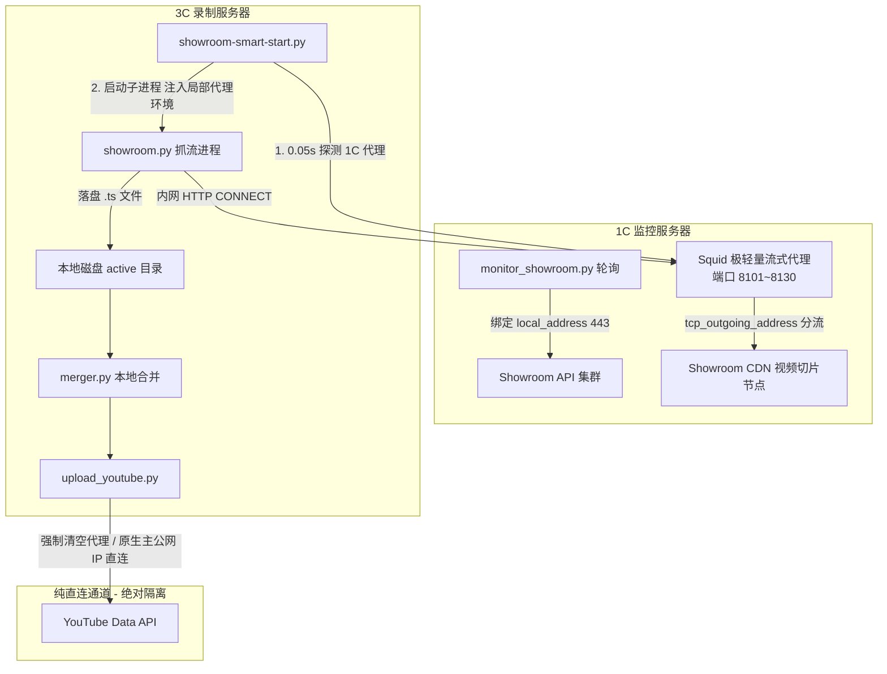

# 09 录制多 IP 分流与中转代理详细设计书

版本：v0.1 · 编制日期：2026-09-27 · 状态：设计评审稿 · 敏感信息已脱敏

---

## 1. 背景与课题

### 1.1 现状与痛点
- **现状**：系统监控端（`monitor/monitor_showroom.py`）针对 270+ 成员的常时高频轮询，通过在 1C 主机网卡上绑定的多辅助私网 IP（各自映射独立公网出口），实现了 30 个 IP 的轮询分流。
- **痛点**：录制管理端（`recorder/showroom-smart-start.py`）在启动外部抓流进程（`showroom.py`）时，未指定出站出口，所有并发录制任务默认走系统的单一主网卡 IP 出口。
- **危害**：当多人同时开播（如 5~15 路并发录制）时，单 IP 频繁请求 Showroom API 及高频并发拉取 HLS（`.ts`）视频切片，极易触发 Showroom 平台及 CDN 节点的单 IP 频控限制（HTTP 429 / 403 / 丢包限速）。一旦切片下载中断超过阈值，录制管理机制会判定异常并频繁杀进程重启，引发雪崩式录制失败。

### 1.2 关键约束条件
1. **YouTube 上传严禁换 IP**：Google OAuth2 认证对 IP 漂移有极严格的安全风控，频繁轮换 IP 上传或刷新 Token 极易导致授权失效（`invalid_grant`）或账号封禁。YouTube 上传必须 100% 锁定在固定的主出口 IP。
2. **1C 监控机资源安全**：1C 机器承担核心的 24 小时直播监控任务，硬件配置紧凑，任何方案都绝对不能引发 1C 的 CPU 满载、内存 OOM 或日志写爆磁盘。
3. **Oracle Cloud 免费配额限制**：单块虚拟网卡（VNIC）辅助私有 IP 硬上限为 30 个，且免费租户的公网 IP 总配额严格受限。在 1C 已占用 30 个公网 IP 的前提下，直接在 3C 新建大量公网 IP 极大概率触发配额超限错误。
4. **外部脚本黑盒约束**：外部录制脚本 `showroom.py` 内部逻辑未知且独立维护，方案应具备零侵入性，无需修改外部抓流代码。

---

## 2. 总体架构设计

通过将 1C 现成的 30 个出站 IP 配置为**内网流式中转代理**，3C 录制机通过 OCI 私网通道调用代理分流出站。

### 2.1 架构拓扑图



### 2.2 核心设计原则

1. **四层环境隔离**：
   - 全局无代理：不在两台机器的系统级环境变量（`/etc/environment`, `~/.bashrc`）中配置代理；
   - 进程级私有注入：仅在 `subprocess.Popen` 启动 `showroom.py` 时以局部参数形式注入 `HTTP_PROXY` / `HTTPS_PROXY`；
   - 本地流量直连：同时注入 `NO_PROXY="localhost,127.0.0.1,10.0.0.0/16"` 确保内网通信不受阻；
   - 上传防守隔离：在 `upload_youtube.py` 执行入口强制清理代理环境变量，确保永远 100% 走 3C 原生固定 IP 直连 Google。
2. **秒级自动降级（Fail-safe）**：
   - 录制进程启动前，对目标代理端口进行 **0.05 秒** 的轻量 socket 连通性测试；
   - 探测成功：享受 30 个 IP 负载均衡分流；
   - 探测失败（1C 维护/网络抖动/代理异常）：**立刻平滑退回现有的直连模式**，保证录制绝不因为中转代理中断。
3. **极简哈希分流调度**：
   - 端口基准：`8101 ~ 8130`（共 30 个端口，对应 30 个出口 IP）；
   - 分配算法：`port = 8101 + (hash(member_id) % 30)`，确保同一成员的重试连接落在稳定出口，不同成员均匀分散至 30 个独立出口。

---

## 3. 性能安全与资源隔离评估（针对 1C）

为确保 1C 上的 `monitor_showroom.py` 监控主任务绝对不受影响，代理服务实施针对性内核调优：

| 关注维度 | 潜在风险 | 本设计防护措施 | 预期 1C 资源占用 | 对监控业务影响 |
|---|---|---|---|---|
| **磁盘 I/O** | 大量 TS 切片请求把 access.log 写满导致系统死机 | **关闭所有访问日志与缓存日志**<br>(`access_log none`) | **0 Byte/s 磁盘写入** | 零影响，绝不发生磁盘满溢 |
| **内存 (RAM)** | 代理缓存大量多媒体切片，触发 OOM 杀掉监控脚本 | **彻底禁用内存缓存与内存池**<br>(`cache_mem 0 MB`, `cache deny all`) | **约 25 ~ 35 MB**<br>(占 1G 内存约 3%) | 极低，绝不会导致 OOM |
| **CPU 算力** | 大流量转发导致 CPU 满载，监控轮询超时 | 纯 TCP 盲管道流式转发（HTTP CONNECT），不做 SSL 解密和内容解析 | 平常 **1%~3%**<br>高峰 (10路) **5%~8%** | 监控依然享有 90%+ 算力，轮询耗时无感 |
| **网络带宽** | 录制流量占满带宽 | 10 路录制约 20~30 Mbps，1C 网卡上限 480Mbps~1Gbps | 仅占物理网卡带宽 **3%~6%** | 小包（API 轮询）内核调度优先，延迟无变化 |
| **业务冲突** | 录制导致 Showroom 封禁 IP 影响检测 | 录制访问 CDN 节点，检测访问 API 业务集群，两套完全不同域名和机房 | 物理路由解耦 | 不发生业务接口频控交叉 |

---

## 4. 部署与配置方法（脱敏版）

### 4.1 第一阶段：1C 监控机（部署轻量代理）

#### 步骤 1：安装 Squid
```bash
sudo apt update && sudo apt install -y squid
```

#### 步骤 2：生成脱敏配置文件
在 1C 执行配置生成脚本（自动读取项目内 `OUTBOUND_IPS` 列表生成 30 个端口映射）：

```bash
sudo tee /etc/squid/conf.d/showroom_30ip.conf > /dev/null << 'EOF'
# ============================================================
# Showroom Autopilot 多出口流式中转配置 (脱敏版)
# ============================================================

# 1. 彻底禁用磁盘与内存缓存（保证 0 磁盘写入与最小内存占用）
cache deny all
cache_mem 0 MB
memory_pools off

# 2. 彻底关闭访问日志（防止日志写满系统盘）
access_log none
cache_store_log none

# 3. 访问控制：仅允许本机及 OCI 虚拟云网络内网访问，拒绝公网直连
acl oci_subnet src 10.0.0.0/16
http_access allow localhost
http_access allow oci_subnet
http_access deny all

# 4. 超时与性能优化
connect_timeout 10 seconds
read_timeout 60 seconds
client_lifetime 4 hours

# 5. 端口监听与出口 IP 绑定 (端口 8101 ~ 8130)
# 说明：以下 IP 为 1C 网卡上已配置的 30 个辅助私网 IP (各映射独立公网 IP)
EOF

# 追加端口与出口映射规则
python3 - << 'PY_EOF'
import sys
from pathlib import Path

# 从项目配置中加载脱敏 IP 列表
config_path = Path.home() / "showroom-autopilot/shared"
sys.path.insert(0, str(config_path))
from config import OUTBOUND_IPS

base_port = 8101
lines = []
for idx, ip in enumerate(OUTBOUND_IPS):
    port = base_port + idx
    lines.append(f"http_port {port}")
    lines.append(f"acl p_{port} localport {port}")
    lines.append(f"tcp_outgoing_address {ip} p_{port}")

with open("/etc/squid/conf.d/showroom_30ip.conf", "a") as f:
    f.write("\n" + "\n".join(lines) + "\n")
print(f"✅ 成功写入 {len(OUTBOUND_IPS)} 个出口端口映射 (8101 ~ {base_port + len(OUTBOUND_IPS) - 1})")
PY_EOF
```

#### 步骤 3：启动服务
```bash
sudo systemctl restart squid
sudo systemctl enable squid
```

#### 步骤 4：放行 1C 系统防火墙（仅允许内网网段访问代理端口）
```bash
# iptables 放行规则（仅放行 OCI 内网 10.0.0.0/16 访问 8101~8130）
sudo iptables -I INPUT -p tcp -s 10.0.0.0/16 --match multiport --dports 8101:8130 -j ACCEPT
```

#### 步骤 5：记录 1C 私网 IP
```bash
hostname -I | awk '{print $1}'
# 输出形如: 10.0.0.X（记录该私网主 IP，用于 3C 配置文件中填入）
```

---

### 4.2 第二阶段：3C 录制机（连通性验证）

登录 3C 录制机终端，执行连通性与多出口验证（将 `<1C_INTERNAL_IP>` 替换为实际查得的私网主 IP）：

```bash
# 测试端口 8101 出口
curl -x http://<1C_INTERNAL_IP>:8101 https://ifconfig.me
echo ""

# 测试端口 8102 出口
curl -x http://<1C_INTERNAL_IP>:8102 https://ifconfig.me
echo ""
```
> **判定标准**：两次输出能正常返回外部公网 IP，且**返回的公网 IP 互不相同**，即证明 3C 已成功打通经由 1C 的 30 个独立出口。

---

## 5. 录制端代码改造规范

### 5.1 配置层变更 (`shared/config.py`)
新增配置项支持环境变量与默认值覆盖：
```python
# ========================= 录制代理中转配置 =========================
ENABLE_RECORDING_PROXY = os.getenv("ENABLE_RECORDING_PROXY", "false").lower() in ("true", "1", "yes")
RECORDER_PROXY_HOST = os.getenv("RECORDER_PROXY_HOST", "<1C_INTERNAL_IP>") # 1C 私网 IP
RECORDER_PROXY_BASE_PORT = 8101
RECORDER_PROXY_PORT_COUNT = 30
```

### 5.2 录制管理层变更 (`recorder/showroom-smart-start.py`)

1. **连通性健康探测函数**：
```python
def is_proxy_available(host: str, port: int, timeout: float = 0.05) -> bool:
    """0.05 秒极速检测目标代理端口连通性"""
    try:
        with socket.create_connection((host, port), timeout=timeout):
            return True
    except (socket.timeout, ConnectionRefusedError, OSError):
        return False
```

2. **成员端口映射与局部环境注入**：
```python
def get_member_proxy_port(member_id: str) -> int:
    """将成员均匀哈希映射到 30 个代理出口"""
    offset = abs(hash(member_id)) % RECORDER_PROXY_PORT_COUNT
    return RECORDER_PROXY_BASE_PORT + offset

def build_recording_env(member_id: str) -> dict:
    """构建录制专用局部环境变量，支持平滑降级"""
    env = os.environ.copy()
    if not ENABLE_RECORDING_PROXY:
        return env
        
    port = get_member_proxy_port(member_id)
    if is_proxy_available(RECORDER_PROXY_HOST, port):
        proxy_url = f"http://{RECORDER_PROXY_HOST}:{port}"
        env["HTTP_PROXY"] = proxy_url
        env["HTTPS_PROXY"] = proxy_url
        env["http_proxy"] = proxy_url
        env["https_proxy"] = proxy_url
        env["NO_PROXY"] = "localhost,127.0.0.1,10.0.0.0/16"
        logging.info(f"{member_id}: [代理分流] 成功分配出口 1C:{port}")
    else:
        logging.warning(f"{member_id}: [代理降级] 1C:{port} 探测不可达，自动回退直连模式")
        
    return env
```

3. **子进程启动注入**：
```python
process = subprocess.Popen(
    ["bash", "-c", cmd_str],
    stdout=log_fd,
    stderr=subprocess.STDOUT,
    preexec_fn=os.setpgrp,
    env=recording_env # 仅子进程继承代理环境
)
```

### 5.3 上传发布防守变更 (`recorder/upload_youtube.py`)
在上传主流程入口强化环境变量清理：
```python
# 彻底移除所有可能的代理配置，确保 YouTube 上传 100% 走原生公网出口直连
for proxy_key in ["HTTP_PROXY", "HTTPS_PROXY", "http_proxy", "https_proxy", "ALL_PROXY", "all_proxy"]:
    os.environ.pop(proxy_key, None)
```

---

## 6. 运维与回退预案

1. **一键停用代理（无需重启服务）**：
   - 方式 A：在 3C 的环境配置中将 `ENABLE_RECORDING_PROXY=false`，后续启动的录制进程全部恢复原直连状态。
   - 方式 B：在 1C 上执行 `sudo systemctl stop squid`。3C 的健康探测会自动捕获连接拒绝，并在 0.05 秒内自动全量降级回直连模式，业务不中断。
2. **状态巡检**：
   - 检查 1C Squid 资源开销：`ps aux | grep squid`（关注 RSS 内存占用，常态 < 35MB）；
   - 检查 1C 磁盘写入：`sudo du -sh /var/log/squid`（应维持在几 KB 左右，无持续增长）。
